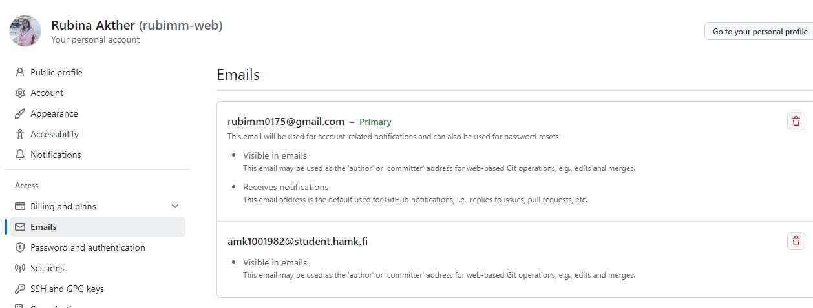

# Assignment 1
# Account Setup
- In  the first step, I'd created Microsoft Azure account using email address that university provoded me.

- Then I got  to know about the cloud and its importance. 

- Additionally, I explored student benefits and open an student account and Azure give me *$100* worth of credits that I can use to purchase any package within the environment.

# Create Virtual Machine
- I created virtual machine where I have to work later on this course.

- Then I select Marketplace from *Ubuntu Server 24.04 LTS gen 2 Server* published by Canonical. 

- I named my machine *"rubi-robotics"*.

- I choose B series version 2 which is *Standard_B2ls_v2*.

- Later, I create a new resource group for the machine and subnet to place the machine in.

# Link my HAMK email to my GitHub account

- I create a new repository named *"linux"* for the assignment.

- Then I add my HAMK email as a secondary mail for version control.

# Assignment 3
This document details the process of creating users and managing permissions in a Linux environment. The tasks include creating different types of users, managing sudo privileges, and setting up a shared directory with specific permissions.

Task 1 & 2: Creating User Tupu and creating user Lupu
The adduser script was used to create the Tupu user. This script provides an interactive way to create a new user with all necessary directories and settings.

The adduser script automatically:

Creates the home directory
Sets up default shell
Prompts for password
Creates user-specific group
Sets up basic profile
For task 2 initially, I tried using the following given command:

sudo useradd -m -d /home/lupu -s /bin/bash -G lupu lupu
However, this resulted in an error: Command error

The issue was that we tried to add the user to a group that didn't exist yet. To fix this, we modified the command to include the -U flag, which automatically creates a user group with the same name as the user:

sudo useradd -m -d /home/lupu -s /bin/bash -U lupu
Creating User Lupu

After creation, Set the password:

sudo passwd lupu
Creating User Lupu

Task 3: Creating System User Hupu
Created a system user Hupu with restricted login capabilities:

sudo useradd --system --shell /bin/false hupu
Creating System User Hupu

This creates a system account that:

Has no login shell (/bin/false)
Is typically used for running services
Has no home directory by default

Task 4: Adding Sudo Privileges
Added sudo privileges for both Tupu and Lupu users using the usermod command:

sudo visodu
Then adding:

tupu ALL=(ALL:ALL) ALL
lupu ALL=(ALL:ALL) ALL
Adding Sudo Privileges

Alternative method using:

Adding Sudo Privileges

Task 5: Setting Up Shared Directory
This task required creating a shared directory with specific permissions for Tupu and Lupu. Here's the detailed solution:

The permission setup (2770) breaks down as:

2: SetGID bit (ensures new files inherit group ownership)
7: Owner has full permissions (read/write/execute)
7: Group has full permissions (read/write/execute)
0: Others have no permissions
This configuration ensures:

Only Tupu and Lupu can access the directory
New files automatically inherit the projekti group
Other users cannot access the directory
Both users have full control over the directory and its contents
To verify the setup:

sudo ls -la /opt/projekti
